# Portfolio Web App Template 2

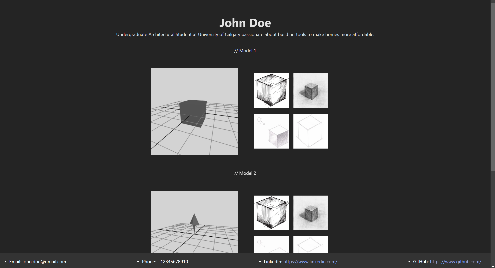  
[Website Preview for Template 1](https://architecural-student-portfolio-1.vercel.app/)  
[Github Link for Template 1](https://github.com/jzmasiv/Architecural-Student-Portfolio-1)  

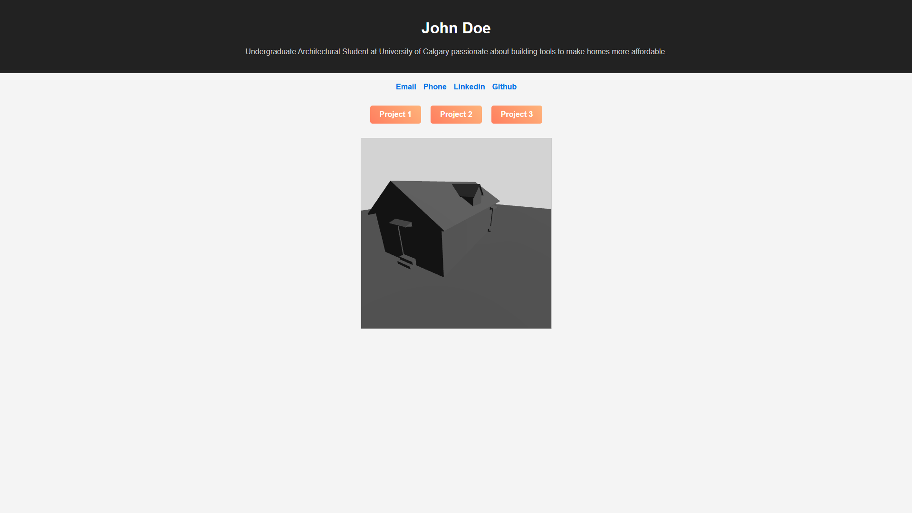  
[Website Preview for Template 2](https://architectural-student-portfolio-2.vercel.app/)  
[Github Link for Template 2](https://github.com/jugsidhu/Architectural-Student-Portfolio-2)  

This is a personal portfolio web application built using [Vite](https://vitejs.dev/). It showcases one's projects, skills, and contact information as a passionate architectural student.

---

## How to Deploy This Portfolio

Follow these step-by-step instructions to deploy your portfolio on [Vercel](https://vercel.com/) and customize it using [Visual Studio Code](https://code.visualstudio.com/).

---

### 1. Download and Install Node.js

1. Go to the [Node.js download page](https://nodejs.org/).
2. Download the **LTS (Long-Term Support)** version for your operating system (recommended for most users).   
   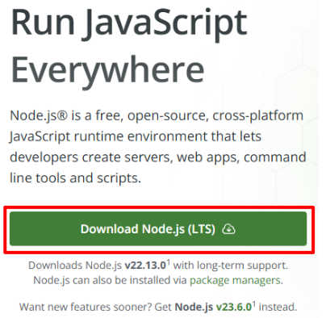  
3. Open the node downloader under recent download history in the top right once it has finished downloading.  
   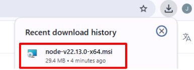
4. Continue clicking through the downloader until you have reached the custom setup section, and make sure add to Path is selected.    
   
5. Continue clicking through the downloaded until you have reached the tool for native moduels section, and make the box is selected.  
   
6. Fianlly, after all the previous steps are completed click install and wait for node to finish installing fully
   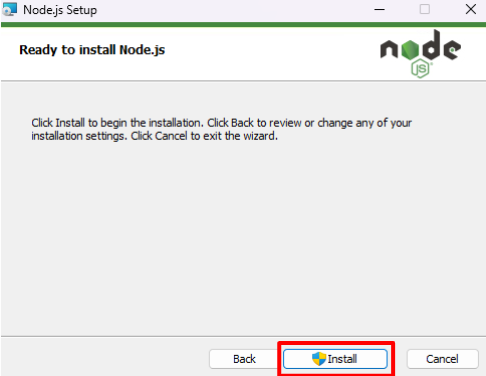
   
---

### 2. Download and Install Visual Studio Code (VS Code)

1. Go to the [VS Code download page](https://code.visualstudio.com/).
2. Download the version for your operating system (Windows, macOS, or Linux).
3. Install VS Code by following the on-screen instructions.

---

### 3. Create a GitHub Account

If you don’t already have a GitHub account, create one at [github.com](https://github.com/).

---

### 4. Fork and Clone the Repository

1. **Fork the Repository:**

   - Scroll up this page and click the **Fork** button in the top-right corner. This creates a copy of the project under your GitHub account.

2. **Clone the Repository:**

   - Copy the repository URL from your forked repository (click the green "Code" button and copy the HTTPS link).
   - Open VS Code and open the terminal (use `Ctrl+` `` ` `` on Windows or `Cmd+` `` ` `` on macOS).
   - Run the following command to clone the repository into a folder:
     ```bash
     git init
     git clone https://github.com/jugsidhu/Architectural-Student-Portfolio-2.git
     ```
     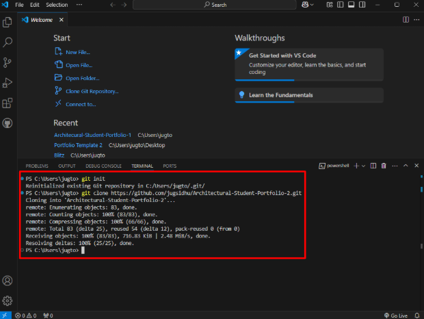   

3. **Open the Cloned Folder in VS Code:**
   - Use the **File > Open Folder** option in VS Code to open the folder where you cloned the repository.  
     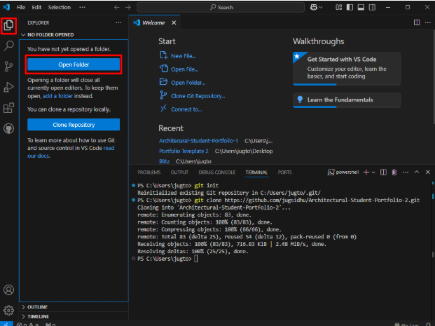
     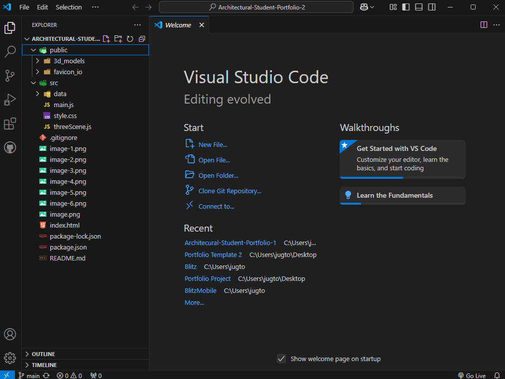   

---

### 5. Set Up a Vercel Account

1. Go to [vercel.com](https://vercel.com/) and click start deploying.  
     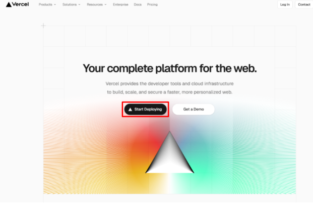
2. Click continue with github and login with your github account  
     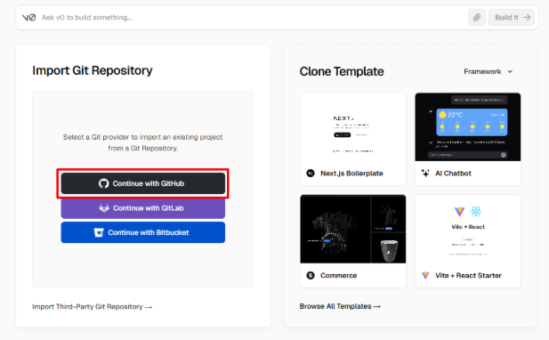

### 6. Install Project Dependencies and Running Locally

1. **Install Dependencies:**

   - In the VS Code terminal, navigate to the project folder (if not already there) and run:
     ```bash
     npm install
     ```

2. **Run the Development Server:**

   - Start the local server by running:
     ```bash
     npm run dev
     ```
   - Open the browser and navigate to the URL provided by the terminal (usually `http://localhost:5173`).

3. **Customize Your Portfolio:**
   - Edit the project files (data.js) to update them with your personal information.
   - The browser will automatically update when you save changes and refresh the page.

---

### 7. Deploy to Vercel

1. **Push Changes to GitHub:**

   - After customizing the portfolio, push the changes to your GitHub repository:
     ```bash
     git add .
     git commit -m "Updated portfolio"
     git push -u origin main
     ```

2. **Deploy on Vercel:**

   - Import the repository from GitHub.  
      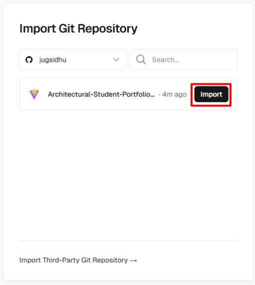  
   - Follow the setup instructions and click **Deploy**.
      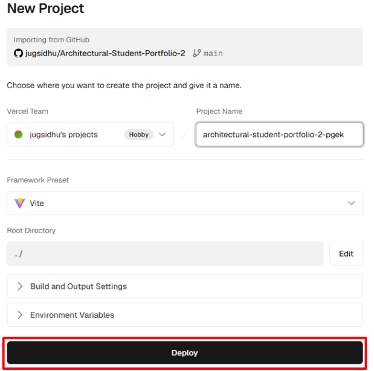

3. **Access Your Portfolio:**
   - Once deployed, access your live portfolio using the URL provided by Vercel.  
      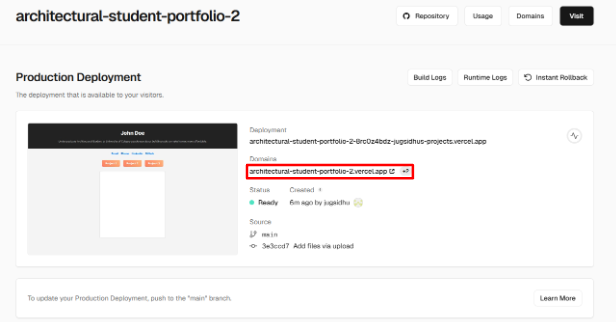

---

You're all set! 🎉 Your portfolio is now live and ready to share.

### More Resources (for Portfolio Customization)

- https://www.w3schools.com/w3css/defaulT.asp
- https://www.w3schools.com/html/
- https://vite.dev/
- https://threejs.org/docs/index.html#manual/en/introduction/Creating-a-scene

